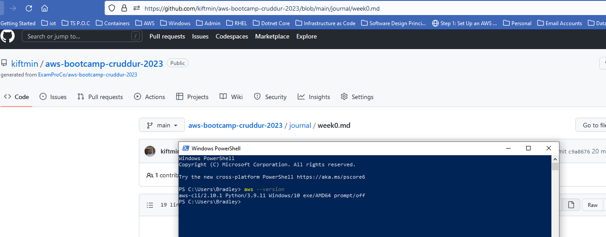
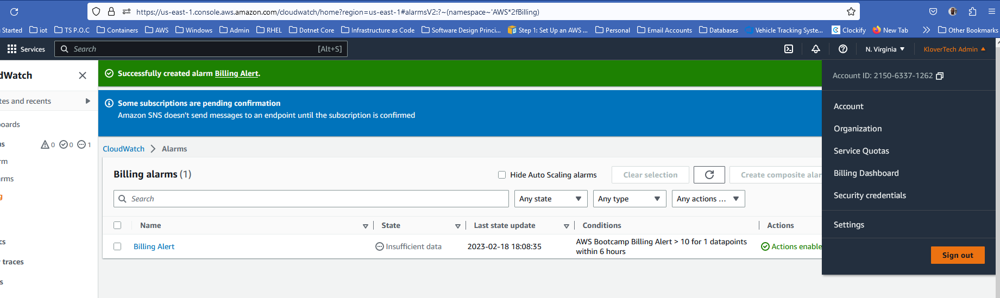
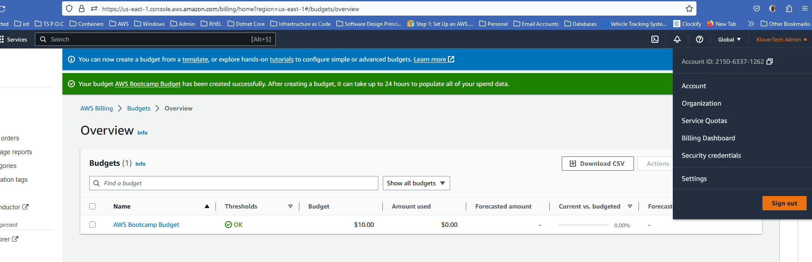

# Week 0 — Billing and Architecture
## Required Homework
### Installing the AWS CLI
I attempted installing doing this using the frollowing instructions:

```
$ curl "https://s3.amazonaws.com/aws-cli/awscli-bundle.zip" -o "awscli-bundle.zip"
unzip awscli-bundle.zip
sudo ./awscli-bundle/install -i /usr/local/aws -b /usr/local/bin/aws

```
However, I get the following error:

```
/usr/bin/env: ‘python’: No such file or directory
```
I'm still busy troubleshooting. Should be able to figure it out. Will update this doc when I have completed this task

In the meantime I have installed AWS CLI on my Windows PC. Please find proof below



### Adding Budget and Alarms to AWS account

Please find the below screenshots to confirm that I have added AWS Alarms and Budgets




### Recreate Logical Architectual Diagram in Lucid Charts

Below is the link to my architectural diagram

[Logical Architectual Diagram](https://lucid.app/lucidchart/0b580349-3707-4938-b885-52df7add558e/edit?viewport_loc=-480%2C-123%2C3012%2C1499%2C0_0&invitationId=inv_4618ee4f-5f00-4207-8e36-ed424d6f2bc3)


